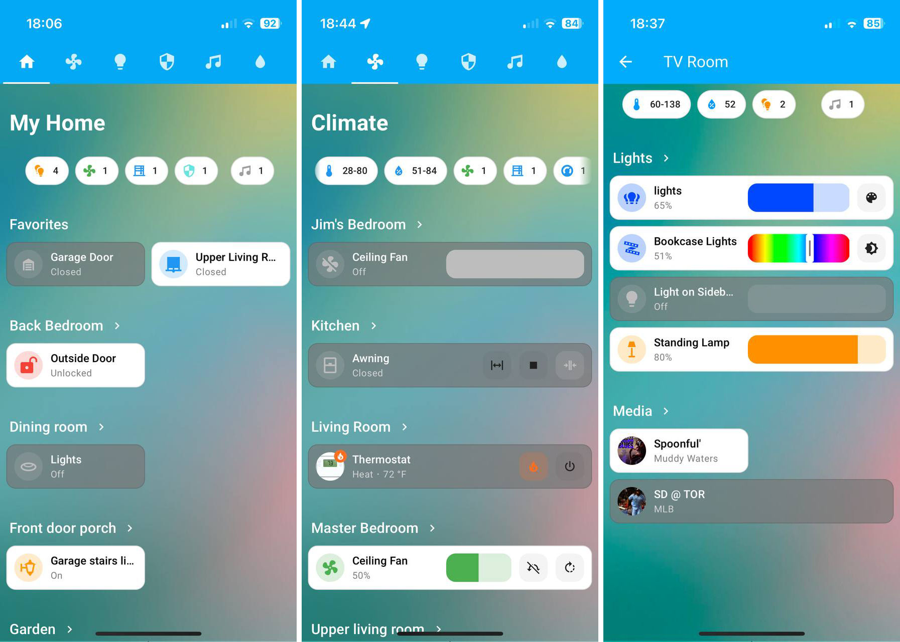
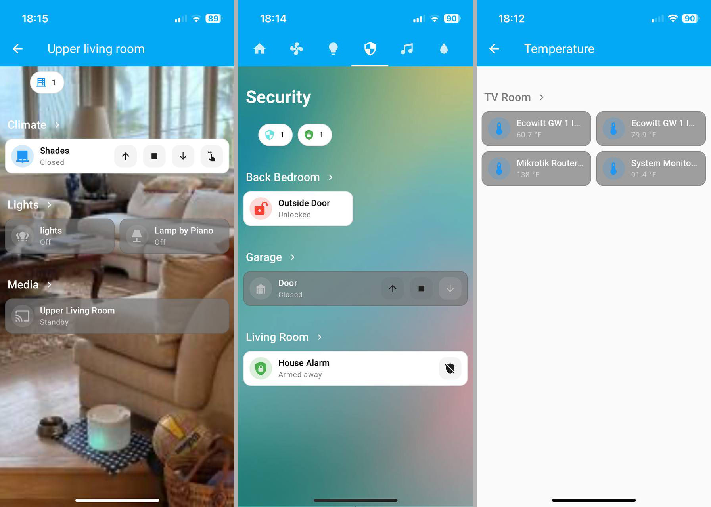

# Homekit Dashboard

Generate Home Assistant dashboards that behave like the Apple Home app.
Mainly focused on the Home Assistant Companion app but the dashboards also work in browsers.

Homekit Dashboard makes extensive use of Home Assistant areas and labels ("On Home View", "Favorite", "In Summaries") and other settings.
Areas drive dashboard creation, only entities assigned to an area are included in the dashboard.
Labels determine what entities are included on the home page and in badges.
Adding entities is described in [Populating the dashboard](#populating-the-dashboard) below.



<details>
  <summary>More screens</summary>

  
</details>

## Configuring Homekit Dashboard

The [installation file][installationUrl] goes into detail, including how to install without HACS, but tl;dr to get a bare dashboard up and running if you have [HACS][hacsInstallUrl] installed:

1. Install dependencies:

- _Mushroom Cards_

  [![Open in HACS at your Home Assistant instance.][hacsBadge]][mushroomCardsHacs]

- _Card Mod 3_
  
  [![Open in HACS at your Home Assistant instance.][hacsBadge]][cardModHacs]

- and optionally _Kiosk Mode_ (this needs Home Assistant 2025.5.0 and Kiosk Mode v7.0.0 or later):
  
  [![Open in HACS at your Home Assistant instance.][hacsBadge]][kioskModeHacs]

2. Install Homekit Dashboard

  [![Open in HACS at your Home Assistant instance.][hacsBadge]][homekitDashboardHacs]

3. Restart Home Assistant: go to `Settings`, click the 3 vertical dots at the top-right corner and select _Restart Home Assistant_ from the drop-down, click _Restart Home Assistant_ and then _RESTART_

4. Go to `Settings->Dashboards`, click on _ADD DASHBOARD_ and create an empty dashboard

5. In the popup fill in the Title, leave the rest as-is and click _CREATE_

6. Click the _OPEN_ button on the newly-created entry in the Dashboards list

7. Click the pen icon at the top-right corner of the dashboard

8. Click the 3 vertical dots at the top-right corner of the dashboard and select _Raw configuration editor_ from the dropdown

9. Replace the text that appears with:
   ```yaml
   strategy:
     type: custom:homekit-dashboard
     views: []
   ```
   
   then click _SAVE_ and then the _X_ at the top left corner of the editor window to close it

10. Click the _DONE_ button at the top right

You now have an empty home page "My Home" and no badges.
[Populating the dashboard](#populating-the-dashboard) below explains how to add entities by assigning areas and labels.
The [configuration file][configurationUrl] explains how to change the home page name, default background and other settings.

If you already have entities assigned to areas they they should show up in one of the other (non-Home) views, otherwise those views will also be empty.

The new dashboard should show up in the Companion App.
If it doesn't you may have to clear the frontend cache (on the device) by going to `Settings->Companion app->Debugging` and clicking _Reset the frontend cache_.

NOTE: by default the sidebar and overflow button are hidden on mobile devices so if you're installing via your phone, once you open the dashboard there will be no way to exit.
See the [configuration file][configurationUrl] for how to override this _before_ installing via a mobile device.

# Populating the dashboard
Only entities assigned to an area will appear in the dashboard.
It's not necessary to assign every entity:
if a device is assigned to an area all its entities are also assigned to that area (this can be overridden per entity).

Area and label assignment can be done piece-meal or in bulk but only needs to be done once.
Home Assistant supports easy bulk assigning except for assigning areas to entities.

## Areas
Areas can really simplify automations, etc. so are a good idea in general, but Homekit Dashboard won't work at all without them.
For my personal home system I make every room an area, plus garage, front porch, garden and a generic "outside".

Create areas by going to `Settings->Areas, labels & zones`, selecting the `Areas` tab and clicking _CREATE AREA_.
Give the area a name and fill in any other desired fields, Homekit Dashboard currently only uses the name and the background picture.
Once created clicking on the pen icon allows specifying related temperature and humidity sensors but these are currently also not used.

If relevant it can also be useful to add floors (_CREATE FLOOR_ on the same page).
This allows for e.g. "Turn off all downstairs lights".

## Labels
Homekit Dashboard needs 3 labels:
- `On Home View`
- `Favorite`
- `In Summaries`

Go to `Settings->Areas, labels & zones`, select the `Labels` tab and create them.
Only the name is used, make sure it is exactly as given here.

Labels work the same way as in Apple Home: setting the _On Home View_ label on an entity will place it on the app home page;
setting _Favorite_ will place it in the _Favorites_ section on the home page (independent of _On Home View_);
the _In Summaries_ label will include the entity in the badge count for that kind of entity if it is "on" in some sense (counts are filtered by area in area views).
The _On Home View_ and _Favorite_ labels only influence whether and how an entity appears on the home page.
The _In Summaries_ label only influences how/if badges are shown.

## Assigning labels and areas
The following is a fairly efficient way to bulk-configure the dashboard entities.

### Devices
To assign devices (and all their entities) to areas:

1. Go to `Settings->Devices & services` and select the `Devices` tab
2. Click on _Filters/Integrations_
3. Select only the Integrations that have devices of interest (in my case that narrows the list down by 75%)
4. Click on the _Enter selection mode_ button to the left of the search bar
5. Select all the devices that are in 1 particular area
6. Click on _Move to area_ and select that area
7. rinse, repeat for the other areas

Devices can have labels assigned to them but these are not used by Homekit Dashboard.

### Entities
Entities that don't inherit an area from a device, or where the area is different from the device, need to be set separately:

1. Go to `Settings->Devices & services` and select the `Entities` tab
2. Click on _Filters/Domains_
3. Select a domain, e.g. _Lights_
4. Click on the _Enter selection mode_ button to the left of the search bar
5. Select all entities that you want to have a particular label
6. Click on _Add label_ and select that label (and others if relevant)
7. rinse, repeat

These domains may have relevant entities:

- Alarm control panel
- Binary sensor
- Climate
- Cover
- Fan
- Light
- Lock
- Media player
- Sensor
- Switch
- Vacuum

Going through long lists of entities item by item to decide what to select is no fun, so it helps to use filters and column sorting to group them.
For example for lights you might select domain _Lights_, sort on _Integration_, and add the _In Summaries_ label to all lights that do not have integration _Group_.

Entities will appear in the dashboard as they are assigned to areas and get labels.

### Hiding an entity
Sometimes an entity will be put on the dashboard that's not wanted.
For instance a templated fan might show up twice: once for the actual fan and once for the template.
Turning off _Visible_ in the entity settings for the actual fan will prevent it from appearing on the dashboard.

[hacsBadge]: https://my.home-assistant.io/badges/hacs_repository.svg

[releaseBadge]: https://img.shields.io/github/v/tag/digilive/mushroom-strategy?filter=v2.3.2&label=Release

[sponsorBadge]: https://img.shields.io/badge/Sponsor_him-%E2%9D%A4-%23db61a2.svg?&logo=github&color=%23fe8e86

<!-- Repository References -->

[repositoryUrl]: https://github.com/hwhesselink/homekit-dashboard
[issuesUrl]: https://github.com/hwhesselink/homekit-dashboard/issues
[discussionsUrl]: https://github.com/hwhesselink/homekit-dashboard/discussions
[wikiUrl]: https://github.com/hwhesselink/homekit-dashboard/wiki
[installationUrl]: docs/INSTALLATION.md
[configurationUrl]: docs/CONFIGURATION.md
[homekitDashboardHacs]: https://my.home-assistant.io/redirect/hacs_repository/?owner=hwhesselink&repository=homekit-dashboard&category=plugin

[mushroomCards]: https://github.com/piitaya/lovelace-mushroom
[mushroomCardsHacs]: https://my.home-assistant.io/redirect/hacs_repository/?owner=piitaya&repository=lovelace-mushroom
[cardMod]: https://github.com/thomasloven/lovelace-card-mod
[cardModHacs]: https://my.home-assistant.io/redirect/hacs_repository/?owner=thomasloven&repository=lovelace-card-mod
[kioskMode]: https://github.com/NemesisRE/kiosk-mode
[kioskModeHacs]: https://my.home-assistant.io/redirect/hacs_repository/?owner=NemesisRE&repository=kiosk-mode

<!-- Other References -->

[hacsUrl]: https://hacs.xyz
[hacsInstallUrl]: https://www.hacs.xyz/docs/use

[miniGraphUrl]: https://github.com/kalkih/mini-graph-card
